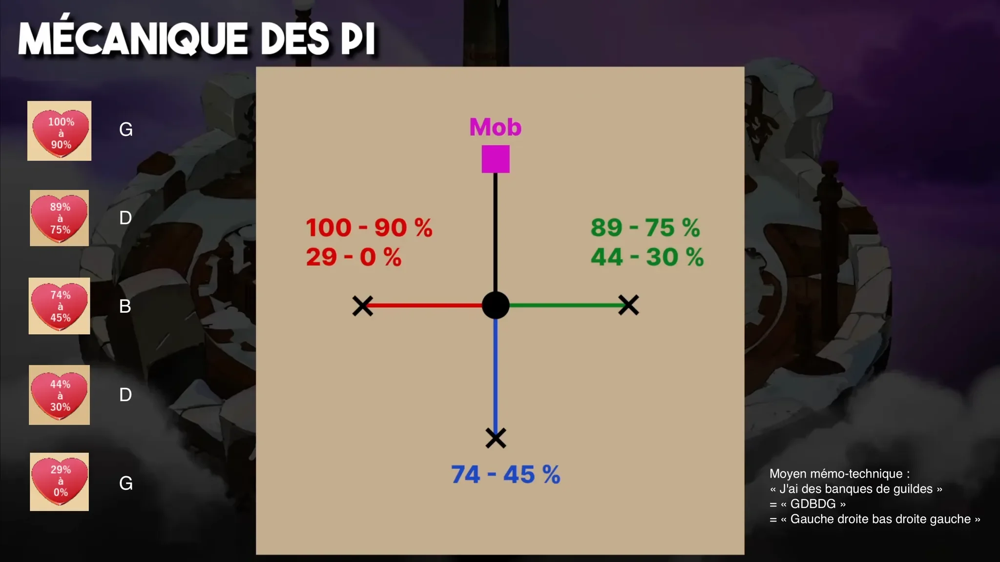

# Harebourg UX

Overlay de projection pour la mécanique de confusion lors du combat final du Donjon du Comte Harebourg. Projette une map tactique sur votre écran, lis le chat dofus pour prendre en compte votre état de confusion, et vous montre la case réelle de vos sorts.

## Avertissement

Harebourg UX n'est ni affilié, ni endorsé par Ankama. Malgré le fait que Harebourg UX ne modifie pas le client et ne lit ni fichiers, ni mémoire, ni paquets, et ne viole pas directement les conditions d'Ankama - nous ne pouvons pas garantir être prôtéger contre les bans, on ne pouvons pas être tenu responsable. L'application est similaire *(on crack)* au [simulateur Comte Harebourg](https://www.comteharebourg.com/) qui est très répandu.

La feuille peut servir en parallèle pour vérifier en cas où l'OCR fonctionnerais mal.

<p align="center">
  
</p>

## Installation

1. Installer [Python 3.14+](https://www.python.org/downloads/windows/) (cocher **py launcher**).
2. Double-cliquer sur **`Lancer Harebourg UX.bat`**. En cas de problème, la fenêtre indique quoi faire.

## Réglage

À refaire après changement de taille de fenêtre, plein écran ou échelle d'interface.

**Carte**
1. Menu → **Régler la carte**.
2. Aligner la grille rouge sur les cases du sol (glissez pour bouger la grille, coins blancs pour redimensionner).
3. Appuyez sur Échap pour terminer.

**Chat** (recommandé pour l'OCR)
1. Menu → **Régler le chat**.
2. Tracer un rectangle sur le chat de combat.
3. Échap.

## Utilisation

1. Souris 4 (MB4) pour marquer votre case **(Moi)**, a refaire après chaque déplacement.
2. Souris 5 (MB5) pour marquer votre cible **(Cible)**.
3. La case rouge **(Vise)** démontre la case sur laquelle jeter vos sorts. 

## Menu

| Entrée | Effet |
|---|---|
| Masquer / Afficher | Cache/affiche le dessin (chat et raccourcis restent actifs) |
| Régler la carte / le chat | Refaire le réglage |
| Marquer ma case / Épingler la cible | Changer la touche : appuyer sur une touche (Ctrl, Maj, Alt possibles) ou Souris 3/4/5. Échap annule. |
| Touches par défaut | Revenir à Souris 4 / Souris 5 |
| Quitter | Fermer |

## Dépannage

| Problème | Solution |
|---|---|
| Direction ne suit pas le chat | Lire `%AppData%\HarebourgUx\last-ocr.txt`. Texte trop petit → agrandir police du chat ou échelle d'interface. |
| Grille décalée | Refaire **Régler la carte**. |
| Harebourg UX s'est arrêté | Détails dans `%AppData%\HarebourgUx\harebourg.log`. |

Config: `%AppData%\HarebourgUx\`. 
OCR: Windows intégré.

## Tests

```
py -3 -m unittest discover -s tests -v
```
